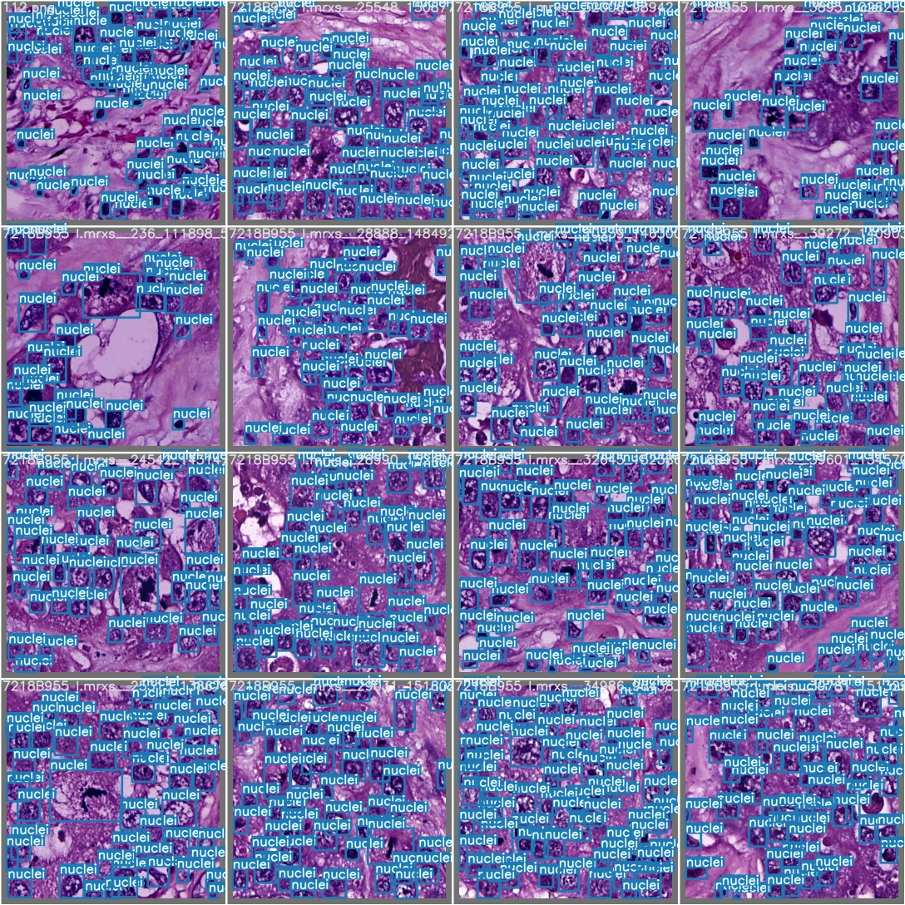
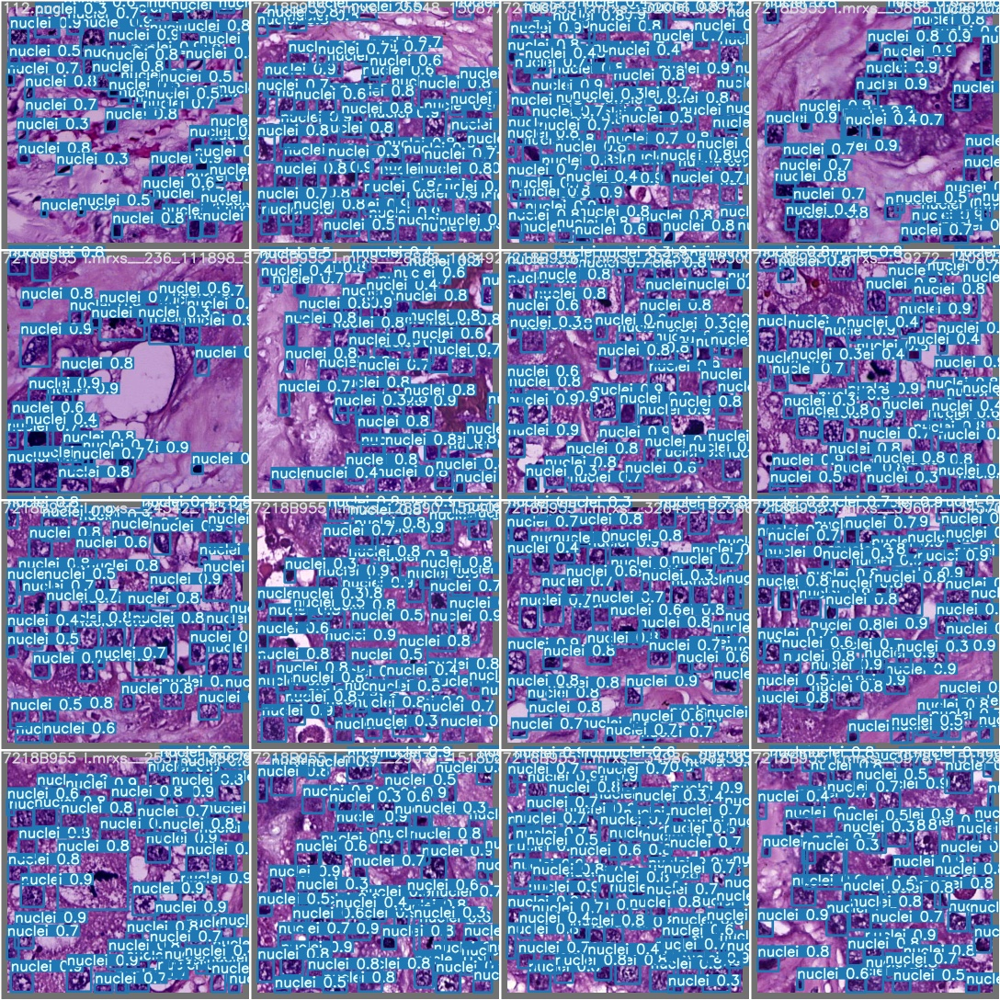

# MITNET-det
Scaled-YOLOV4 was used for MITNET-det. https://github.com/WongKinYiu/ScaledYOLOv4 repo was used for the implementation of the codes.

## Installation


```
# create the docker container, you can change the share memory size if you have more.
nvidia-docker run --name yolov4_csp -it -v your_coco_path/:/coco/ -v your_code_path/:/yolo --shm-size=64g nvcr.io/nvidia/pytorch:20.06-py3

# install mish-cuda, if you use different pytorch version, you could try https://github.com/thomasbrandon/mish-cuda
cd /
git clone https://github.com/JunnYu/mish-cuda
cd mish-cuda
python setup.py build install

# go to code folder
cd /yolo
```
# Training
```
python train.py --img-size 512 --batch-size 16 --epochs 150 --data data/nuclei.yaml --cfg models/yolov4-p5.yaml --weights yolov4-p5.pt --name yolov4-p5-results  --cache
```

# Testing
```
python test.py --task test --img-size 512 --batch-size 16 --data data/nuclei.yaml --weights runs/exp4_yolov4-p5-results/weights/best_yolov4-p5-results_strip.pt
```

# Examples

Ground Truth             |  Prediction
:-------------------------:|:-------------------------:
  |  

### Note: Model weights will not be shared. Only the method is shared.
